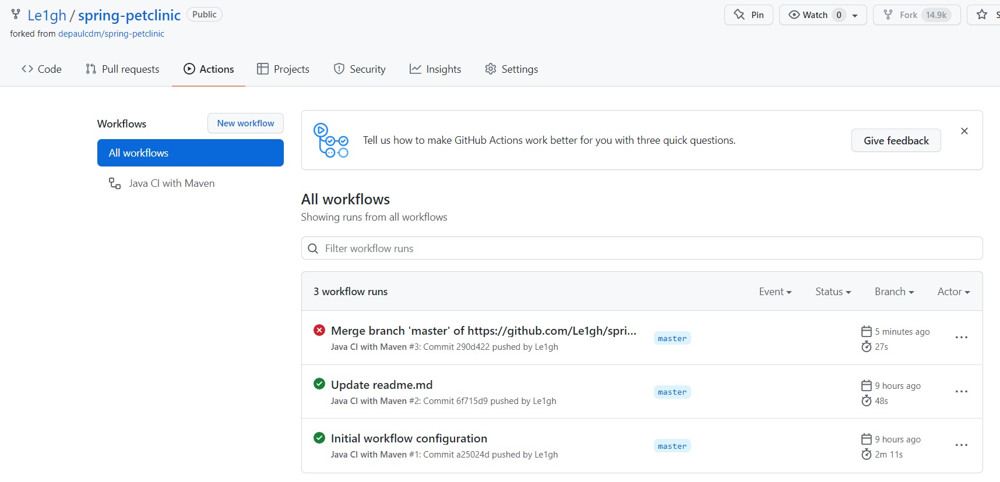
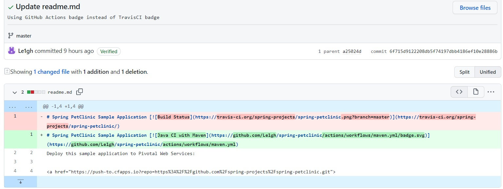
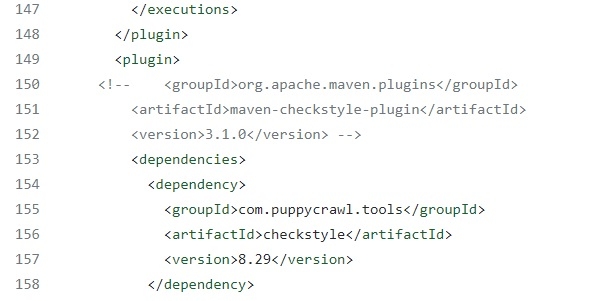
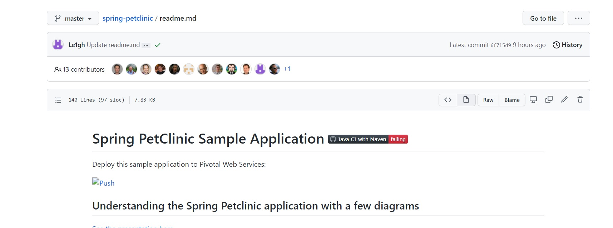
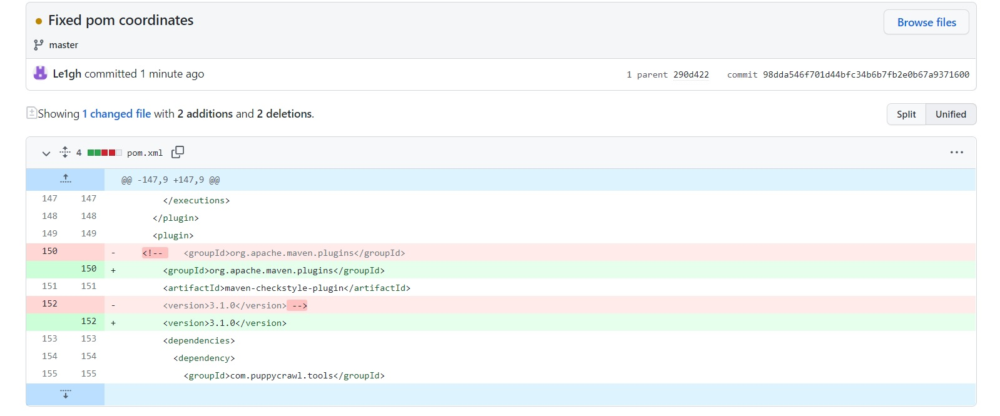
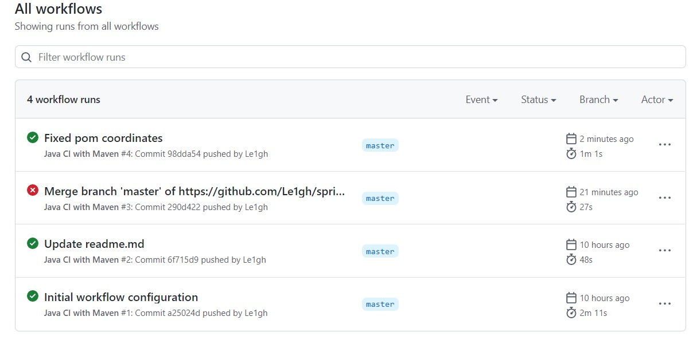
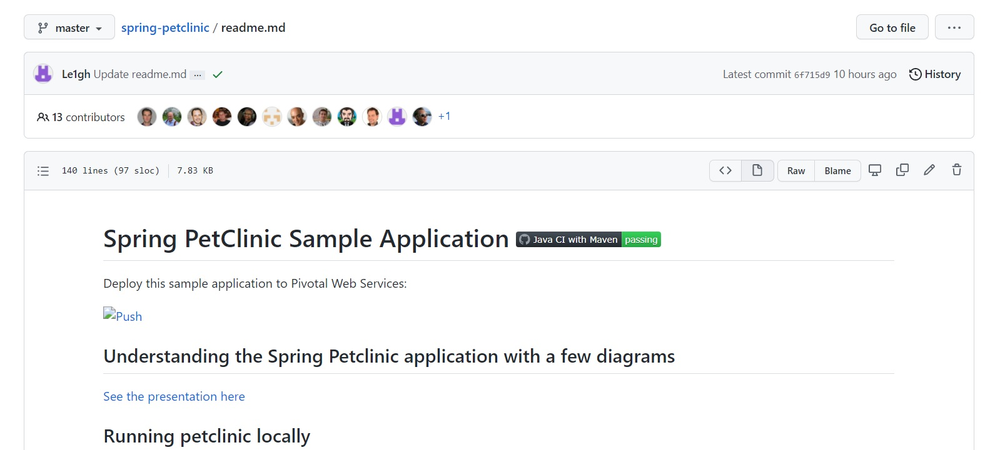

Leigh Arber
Student ID: 1927005

GitHub forked repo, no image needed
[Forked repo](https://github.com/Le1gh/spring-petclinic/)

Github actions showing successful first build:

Github repo with readme.md selected:

POM file commented:

Github Actions showing unsuccsesful build:

Readme - fail

Fixed POM

Fixed build after POM

Fixed readme

